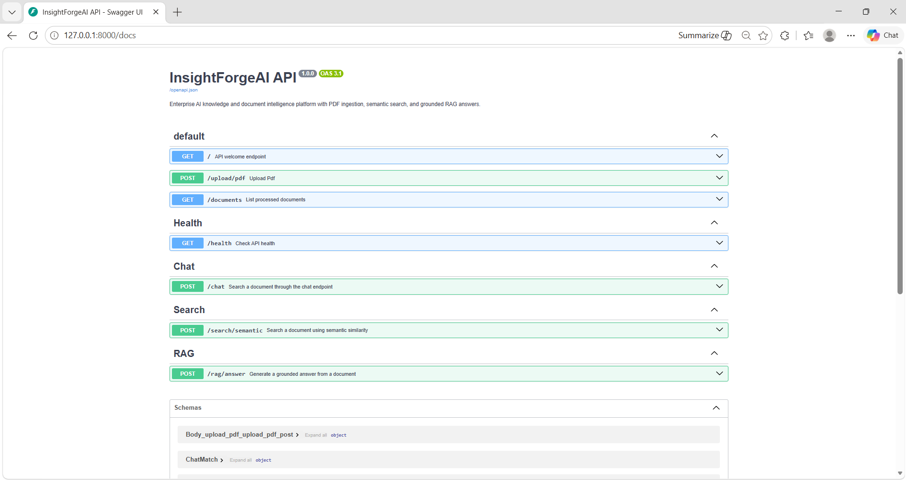
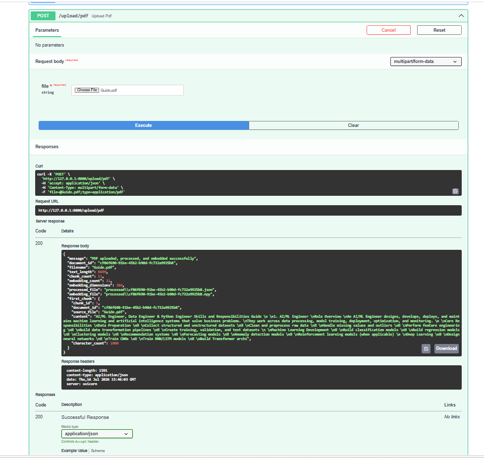
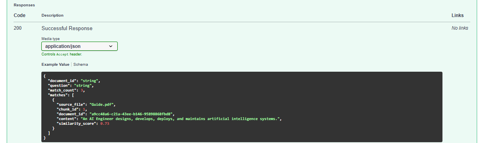
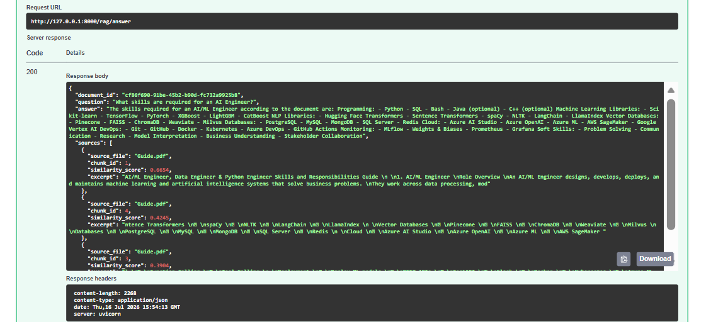
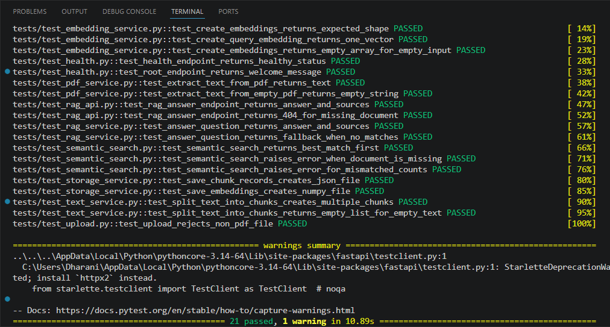
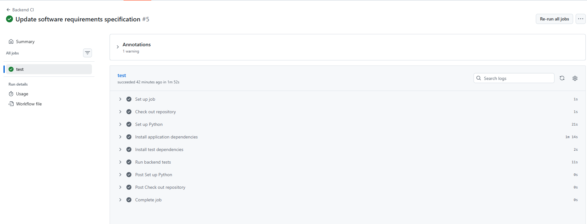

# 🚀 InsightForgeAI

## AI-Powered Document Intelligence & Retrieval Platform

Upload • Process • Search • Chat with Enterprise Documents using AI

Built with Python, FastAPI, Sentence Transformers, OpenAI, Retrieval-Augmented Generation (RAG), and Vector Similarity Search.

----------------------

# 📖 Overview

InsightForgeAI is an enterprise-style AI document intelligence platform
that allows users to upload PDF documents, extract text, generate
embeddings, perform keyword and semantic search, and ask questions using
Retrieval-Augmented Generation (RAG).

The project demonstrates how modern AI applications combine document
processing, vector search, REST APIs, and Large Language Models into a
production-style backend.

----------------------

# ✨ Features

## 📄 Document Processing

-   ✅ PDF Upload
-   ✅ PDF Text Extraction
-   ✅ Intelligent Document Chunking
-   ✅ Metadata Generation
-   ✅ Local Processed Document Storage

## 🔍 Search

-   ✅ Keyword Search
-   ✅ Semantic Search
-   ✅ Sentence Transformers Embeddings
-   ✅ Vector Similarity Search (Cosine Similarity)

## 🤖 Retrieval-Augmented Generation (RAG)

-   ✅ Context Retrieval
-   ✅ OpenAI Integration
-   ✅ Grounded AI Responses
-   ✅ Source Attribution

## 🌐 REST APIs

-   ✅ Health API
-   ✅ Upload API
-   ✅ Documents API
-   ✅ Semantic Search API
-   ✅ RAG Question Answering API
-   ✅ Interactive Swagger Documentation

## 🧪 Testing

-   Health API Tests
-   Upload Validation Tests
-   PDF Extraction Tests
-   Chunking Tests
-   Embedding Tests
-   Storage Tests
-   Semantic Search Tests
-   RAG Service Tests
-   RAG API Integration Tests

## ⚙️ DevOps

-   GitHub Actions CI
-   Automated Backend Testing

----------------------

# 🚧 Future Enhancements

-   React Frontend
-   Docker Support
-   User Authentication
-   Vector Database Integration
-   Multi-document Search
-   Cloud Deployment

----------------------

# 🛠 Tech Stack

## Backend

-   Python
-   FastAPI
-   Uvicorn
-   Pydantic

## AI / ML

-   Sentence Transformers
-   OpenAI API
-   Retrieval-Augmented Generation (RAG)
-   Vector Similarity Search
-   Cosine Similarity

## Tools

-   Git
-   GitHub
-   VS Code
-   Pytest
-   GitHub Actions

----------------------

# 🏗 Architecture

For the detailed system design, see:

**docs/Architecture.md**

The architecture includes:

-   PDF Upload
-   Text Extraction
-   Document Chunking
-   Embedding Generation
-   Semantic Search
-   RAG Pipeline
-   OpenAI Integration
-   REST APIs

----------------------

# 📂 Project Structure

``` text
InsightForgeAI/
├── backend/
│   ├── app/
│   ├── uploads/
│   ├── processed/
│   ├── tests/
│   └── requirements.txt
├── docs/
│   ├── Architecture.md
│   ├── ProductVision.md
│   ├── SRS.md
│   └── screenshots/
├── .github/
│   └── workflows/
└── README.md
```

----------------------

# 🚀 Installation

``` bash
git clone https://github.com/dt0806/InsightForgeAI.git

cd InsightForgeAI/backend

python -m venv venv

venv\Scripts\activate

pip install -r requirements.txt
```

## 🔑 Environment Variables

Create a `.env` file inside the `backend` directory:

``` env
OPENAI_API_KEY=your_openai_api_key
```

Note: Never commit your actual `.env` file or API keys to version control. Add `.env` to your `.gitignore` to keep sensitive credentials out of your repository.

----------------------

# ▶ Running the Application

``` bash
uvicorn app.main:app --reload
```

Backend:

    http://localhost:8000

Swagger UI:

    http://localhost:8000/docs

----------------------

# 🧪 Running Tests

``` bash
cd backend
python -m pytest -v
```

----------------------

# 📡 API Endpoints

  Method   Endpoint                            Description
  -------- ----------------------------------- --------------------------
  GET      `/`                                 Welcome endpoint for the InsightForgeAI API
  POST     `/upload/pdf`                       Upload and process a PDF document
  GET      `/documents`                        Retrieve all processed documents
  GET      `/health`                           Check API health status
  POST     `/chat`                             Search a document using the chat endpoint
  POST     `/search/semantic`                  Perform semantic search using vector similarity
  POST     `/rag/answer`                       Generate a grounded answer using the RAG pipeline

----------------------

# 📸 Screenshots

## Swagger UI 

---
## PDF Upload 


---

## Semantic Search 


---

## RAG Answer 


---

## Tests Passed 


---

## GitHub Actions 


----------------------

# 📚 Documentation

-   `docs/Architecture.md`
-   `docs/ProductVision.md`
-   `docs/SRS.md`

----------------------

# 🗺 Roadmap

## ✅ Version 1.0

-   FastAPI Backend
-   PDF Upload & Processing
-   Keyword Search
-   Semantic Search
-   Sentence Transformers
-   RAG Pipeline
-   OpenAI Integration
-   Automated Testing
-   GitHub Actions CI

## 🚀 Version 2.0

-   React Frontend
-   Authentication
-   Docker
-   Vector Database
-   Cloud Deployment

----------------------

# 🎯 Purpose

This project demonstrates enterprise-level AI application development
using Python, FastAPI, semantic search, vector retrieval, and
Retrieval-Augmented Generation (RAG).

----------------------

# 👨‍💻 Author

**Dharani**

GitHub: https://github.com/dt0806