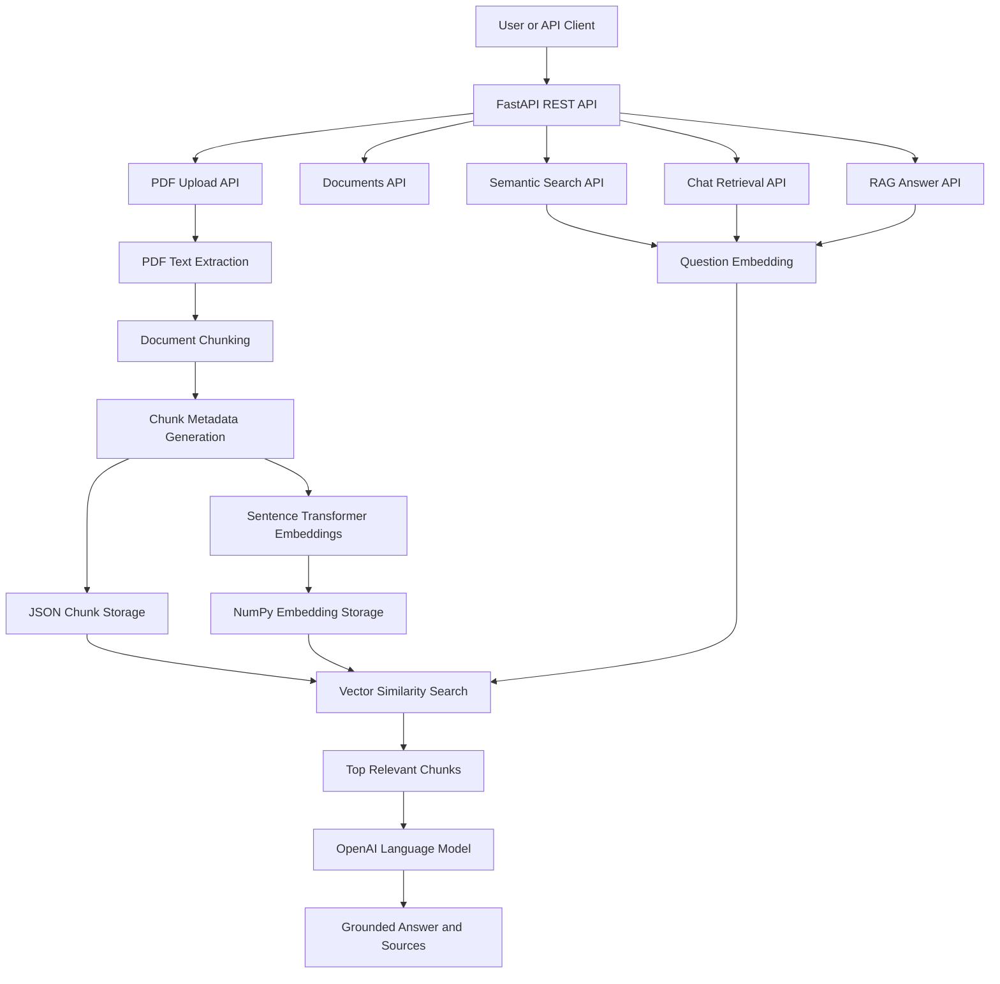

# InsightForgeAI Architecture

## Overview

InsightForgeAI is an AI-powered document intelligence platform built using a modular, service-oriented architecture.

The system allows users to upload PDF documents, automatically extract and process their contents, generate semantic embeddings, perform intelligent document retrieval, and answer natural language questions using Retrieval-Augmented Generation (RAG).

The architecture separates responsibilities into dedicated services, making the application easy to maintain, extend, and test.

---

# High-Level Architecture

---

# Core Components

## FastAPI Backend

The backend exposes REST APIs for:

- Health check
- PDF upload
- Document listing
- Keyword search
- Semantic search
- RAG question answering

---

## PDF Processing Pipeline

After a PDF is uploaded, the system:

1. Extracts text
2. Splits text into chunks
3. Generates metadata
4. Creates embeddings
5. Stores processed data locally

---

## Embedding Service

The embedding service converts document chunks into dense vector embeddings using Sentence Transformers.

These embeddings enable semantic similarity search instead of simple keyword matching.

---

## Semantic Search

When a user asks a question:

- The question is converted into an embedding.
- Cosine similarity is computed.
- The most relevant document chunks are retrieved.

---

## RAG Service

The Retrieval-Augmented Generation service:

- Retrieves relevant chunks
- Builds contextual prompts
- Sends the prompt to OpenAI
- Returns a grounded answer with document sources

---

## Storage

Processed documents are stored locally.

Each uploaded document produces:

- JSON metadata
- NumPy embedding file

---

## Testing

The project includes automated tests for:

- Health API
- Upload validation
- PDF extraction
- Chunking
- Embedding generation
- Storage service
- Semantic search
- RAG service
- RAG API integration

---

## Continuous Integration

GitHub Actions automatically:

- Installs dependencies
- Runs the test suite
- Validates every push to the repository

---

## Technology Stack

Backend

- Python
- FastAPI
- Uvicorn
- Pydantic

AI

- Sentence Transformers
- OpenAI API
- Retrieval-Augmented Generation (RAG)

Testing

- Pytest

CI/CD

- GitHub Actions

Development Tools

- Git
- GitHub
- VS Code